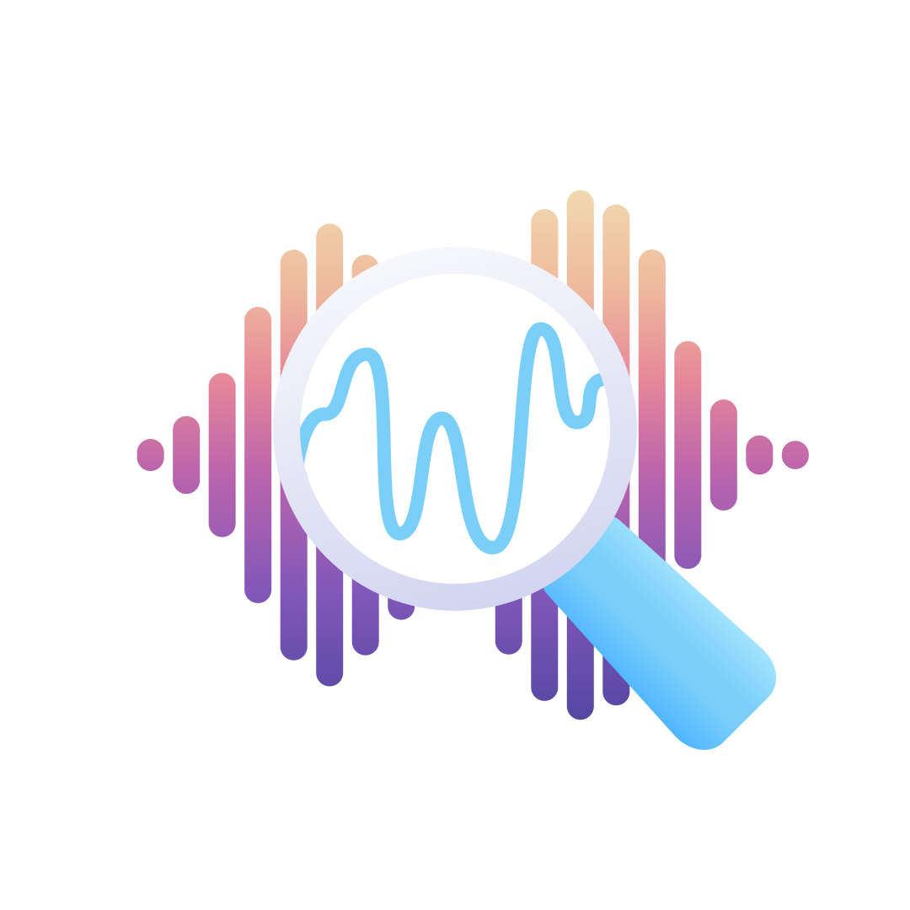
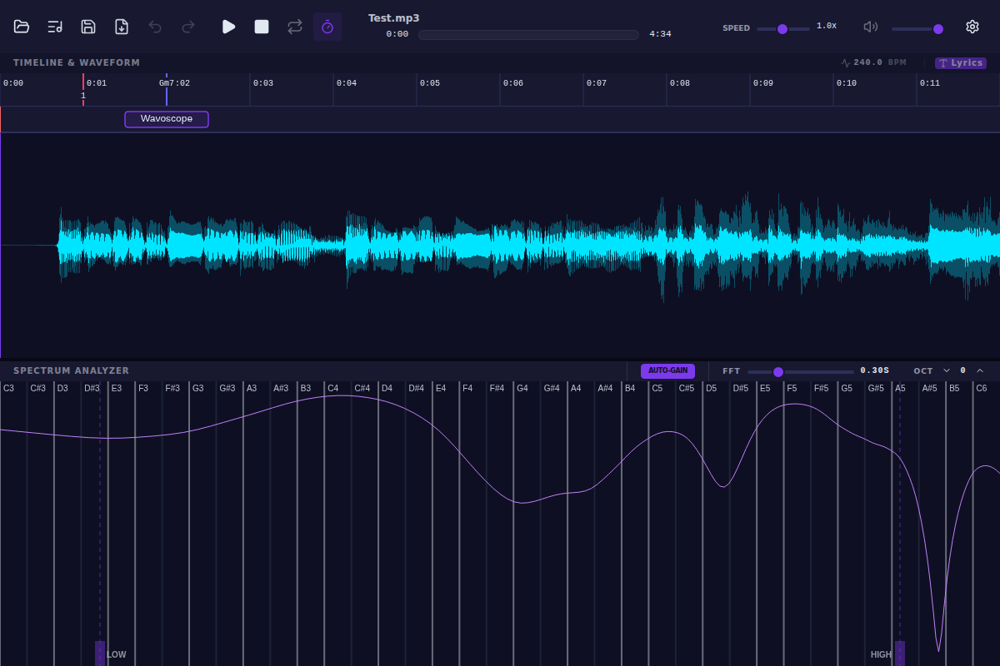
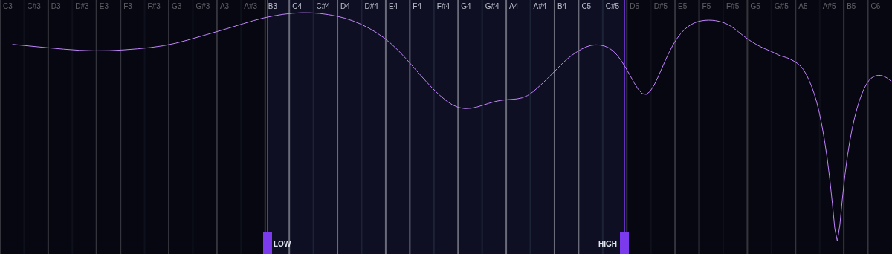
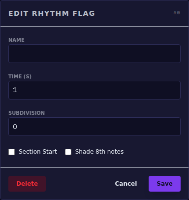
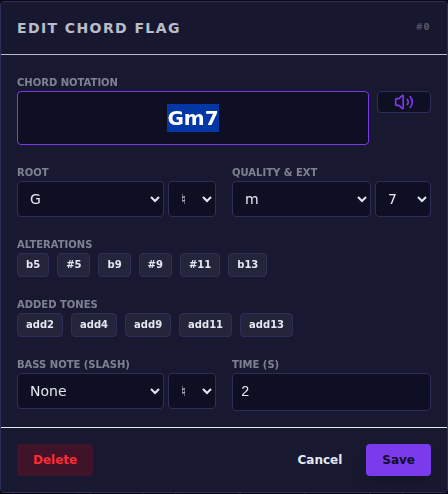
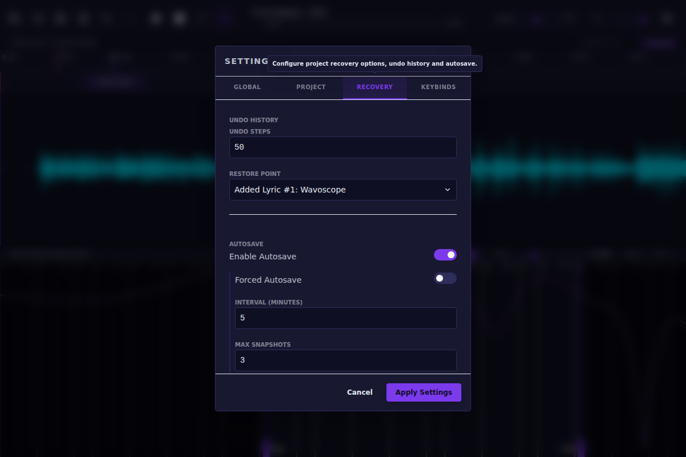

  

# Wavoscope - Herramienta de análisis y transcripción de audio

Wavoscope es una potente herramienta de visualización de audio en tiempo real y ayuda a la transcripción diseñada para músicos, transcriptores e ingenieros de audio. Proporciona formas de onda de alta fidelidad, análisis espectral y un robusto sistema de marcas para ayudarte a deconstruir audios complejos.

---

## 🚀 Primeros pasos

### Iniciar Wavoscope
Wavoscope está diseñado para ser autónomo. No es necesario instalar Python ni ninguna otra dependencia manualmente.
- **Windows:** Haz doble clic en `run.bat`. Esto configurará automáticamente el entorno y creará un archivo `Wavoscope.exe` en la carpeta raíz para su uso futuro.
- **Linux/macOS:** Ejecuta `bash run.sh` en tu terminal. Esto creará un binario `Wavoscope` en la carpeta raíz.

En el primer inicio, Wavoscope descargará automáticamente su propio entorno de ejecución de Python y configurará el entorno necesario. Esto puede tardar unos minutos dependiendo de tu conexión a Internet. Después de la primera ejecución, puedes usar simplemente el ejecutable `Wavoscope` generado (con el icono de la aplicación).

### Gestión de proyectos y autoguardado
Wavoscope utiliza un sistema de archivos "sidecar". Cuando abres un archivo de audio, Wavoscope crea o carga un archivo `.oscope` en el mismo directorio para guardar tus marcas, bucles y ajustes.
- **Abrir:** Haz clic en el icono de la carpeta en la barra de reproducción para cargar cualquier formato de audio común (MP3, WAV, FLAC, etc.).
- **Guardar:** Haz clic en el icono del disquete. El icono brillará con el color de acento de tu tema cuando haya cambios sin guardar.
- **Autoguardado:** Wavoscope crea automáticamente capturas de tu trabajo a intervalos regulares. Puedes configurar la frecuencia del autoguardado, el número máximo de capturas a conservar y la ubicación de almacenamiento en la pestaña **Ajustes > Autoguardado**. Por defecto, los autoguardados solo ocurren si hay cambios sin guardar. Puedes activar el **Autoguardado forzado** para crear siempre capturas independientemente de los cambios. Por defecto, los autoguardados se almacenan en la carpeta temporal de tu sistema.

---

## 🎵 Navegación y reproducción

- **Zoom:** Usa la **rueda del ratón** sobre la forma de onda o el espectro para ampliar o reducir.
- **Desplazamiento:** Usa la **rueda del ratón** sobre la **línea de tiempo** para desplazarte hacia atrás o hacia adelante en el tiempo.
- **Desplazamiento lateral:** **Clica y arrastra** la forma de onda o el espectro para moverte por la línea de tiempo.
- **Subdivisiones adaptativas:** La línea de tiempo ajusta automáticamente sus pasos de rejilla (desde 0,01s hasta varias horas) a medida que haces zoom, garantizando un nivel de detalle óptimo sin sobrecargar la vista.
- **Cursor de reproducción:** **Clic izquierdo** en la forma de onda para mover el cursor de reproducción.
- **Control de velocidad:** Usa el deslizador en la barra inferior para ajustar la velocidad de 0,1x a 2,0x. Wavoscope utiliza un estiramiento de tiempo de alta calidad que preserva el tono.

---

## 🔍 Análisis espectral y filtrado

La mitad inferior de la pantalla muestra un espectrograma de transformada de Q constante (CQT), mapeado a un teclado de piano. Puedes ajustar la **ventana FFT** y el **desplazamiento de octava** usando los controles en la cabecera del analizador de espectro.

### Filtrado avanzado
Puedes aislar instrumentos o notas específicas usando el filtro de banda en tiempo real. Los controladores del filtro (líneas verticales en el espectro) están siempre disponibles:
- **Alternar corte:** **Clic derecho** en un controlador de filtro para activar o desactivar ese límite.
- **Colocación rápida:** **Clic derecho** en cualquier lugar del espectrograma para mover el controlador de filtro más cercano y activarlo.
- **Respuesta visual:** Cuando un corte está activado, la área fuera de su rango se oscurece para ayudarte a concentrarte. Si ambos están desactivados, el filtro se omite.

---

## 🚩 Marcas y transcripción

Wavoscope utiliza un sistema de doble marca para ayudarte a mapear la estructura y la armonía de una pista.

### Marcas de ritmo (Marcadores de ritmo/compás)
- **Colocación:** Presiona `B` (por defecto) o haz **clic izquierdo** en la línea de tiempo para colocar una marca de ritmo.
- **Subdivisiones:** Abre el diálogo de la marca (**clic derecho** en el controlador de la marca) para establecer subdivisiones (p. ej., 4 para negras). Estas aparecen como líneas verticales tenues en la línea de tiempo.
- **Metrónomo:** Las marcas de ritmo activan automáticamente un clic de metrónomo durante la reproducción si los clics de subdivisión están activados.
- **Shift-Click:** Coloca automáticamente una nueva marca al mismo intervalo que la anterior, ideal para mapear rápidamente un ritmo regular.
- **Secciones:** Marca una marca como "Inicio de sección" para darle una etiqueta (como "Verso" o "Estribillo").

### Marcas de armonía (Marcadores de acordes)
- **Colocación:** Presiona `C` (por defecto) o haz **clic derecho** en la línea de tiempo para colocar una marca de armonía.
- **Editor de acordes:** **Clic derecho** en una marca existente para abrir el diálogo de acordes. Puedes escribir nombres de acordes (p. ej., "Am7", "C/G") o usar los selectores.
- **Análisis automático:** Usa el botón **Sugerir** para que Wavoscope analice el audio en esa posición y recomiende el acorde más probable.
- **Escucha:** **Mantén el clic izquierdo** en un controlador de marca de armonía o haz clic en el botón "Reproducir" en el diálogo para escuchar el acorde a través del sintetizador interno.

### Gestión de marcas
- **Arrastrar:** Puedes **clicar y arrastrar** cualquier controlador de marca en la línea de tiempo para ajustar su posición.
- **Solapamientos:** Cuando una marca de ritmo y otra de armonía ocupan el mismo espacio, se muestran a media altura (armonía arriba, ritmo abajo) para que puedas interactuar con ambas.
- **Bucles:** Usa el botón de bucle en la barra de reproducción para alternar entre marcas o toda la pista.

---

## 🎤 Transcripción de letras

Wavoscope incluye una pista de letras interactiva que permite una transcripción y alineación de alta velocidad.

### Flujo de trabajo de transcripción
1. **Alternar pista:** Haz clic en el botón "Letras" en la cabecera de la forma de onda para mostrar la pista de transcripción.
2. **Añadir y escribir:** Presiona `V` o haz un **solo clic** en un espacio vacío en la pista de letras para añadir una palabra.
3. **Entrada de alta velocidad:** Mientras escribes en una caja de letra, presiona **Espacio** o **Guion (`-`)**. Esto hará automáticamente lo siguiente:
    - Confirma la palabra actual.
    - Crea una nueva caja de letra inmediatamente después (en la posición actual del cursor o donde terminó la anterior).
    - Mueve el foco a la nueva caja para que puedas seguir escribiendo sin detener la música.
4. **Búsqueda:** Usa `Shift + Izquierda/Derecha` para saltar entre los elementos de la letra. Esto es perfecto para verificar el tiempo.

### Edición y redimensión
- **Movimiento:** **Arrastra** el centro (80%) de una caja de letra para moverla.
- **Tiempo:** **Arrastra** los bordos (umbral del 10%) de una caja de letra para ajustar su tiempo de inicio o fin.
- **Precisión:** Usa las **teclas de flecha** cuando una letra está seleccionada para moverla en intervalos de 0,1s. Usa las flechas **Arriba/Abajo** para ajustar la duración.
- **Formato:** Las cajas de letras se desvanecen y ocultan el texto automáticamente cuando se hacen demasiado pequeñas con niveles de zoom bajos, manteniendo la interfaz limpia.

---

## ⚙️ Ajustes y personalización

Accede a los ajustes a través del icono del engranaje en la barra de reproducción:
- **Teclas de piano visibles:** Ajusta cuántas teclas se muestran en el teclado de piano del espectro.
- **Volumen del clic:** Controla el volumen de las subdivisiones del metrónomo.

### Temas
Wavoscope es totalmente personalizable con temas. Escoge el estilo que mejor se adapte a tu entorno:
- **Cosmic:** Púrpuras profundos y acentos nebulares.
- **Dark:** Modo oscuro clásico, cómodo para la vista.
- **Doll:** Rosas energéticos y tonos divertidos.
- **Hacker:** Verde terminal retro sobre negro.
- **Light:** Estilo profesional limpio y de alto brillo.
- **Neon:** Azules eléctricos y vibración de alto contraste.
- **OLED:** Fondo negro puro para el máximo contraste.
- **Retrowave:** Estética synthwave de los años 80.
- **Toy:** Colores primarios llamativos.
- **Warm:** Tonos tierra, cómodos para sesiones largas.

---

## 🌍 Localización

Wavoscope soporta varios idiomas. Puedes cambiar el idioma en la pestaña **Ajustes > Global**.

### Traducciones personalizadas
Wavoscope está diseñado para ser impulsado por la comunidad. Puedes añadir o modificar traducciones editando los archivos JSON en el directorio `resources/locales`.
- Para añadir un nuevo idioma, crea un nuevo archivo JSON (p. ej., `fr.json`) y añade un campo `"meta": { "name": "Français" }`.
- La aplicación detectará y listará automáticamente cualquier archivo de traducción válido en el menú de ajustes.

---

## ⌨️ Controles completos

### Atajos de teclado
| Acción | Tecla |
| :--- | :--- |
| **Reproducir / Pausa** | `Espacio` |
| **Detener reproducción** | `Mayús + Espacio` |
| **Alternar metrónomo** | `M` |
| **Alternar ajustes** | `Esc` |
| **Avanzar/Retroceder** | `Izquierda` / `Derecha` |
| **Aumentar/Disminuir velocidad** | `Arriba` / `Abajo` |
| **Subir/Bajar octava** | `Mayús + Izquierda/Derecha` |
| **Tamaño de ventana FFT** | `Mayús + Arriba/Abajo` |
| **Añadir marca de ritmo** | `B` |
| **Añadir marca de armonía** | `C` |
| **Alternar corte de bajos** | `F` |
| **Alternar corte de agudos** | `Mayús + F` |
| **Añadir/Confirmar letra** | `V` |
| **Dividir y avanzar letra**| `Espacio` / `-` (Dentro de la entrada) |
| **Alternar modos de bucle** | `Tab` |
| **Deseleccionar selección** | `Shift + V` |
| **Saltar entre letras** | `Shift + Izquierda/Derecha` |
| **Eliminar elemento seleccionado** | `Suprimir` / `Retroceso` |
| **Abrir archivo** | `Ctrl + O` |
| **Guardar proyecto** | `Ctrl + S` |
| **Exportar MusicXML** | `Ctrl + E` |

### Interacciones con el ratón
| Área | Acción | Interacción |
| :--- | :--- | :--- |
| **Línea de tiempo** | Añadir marca de ritmo | `Clic izquierdo` |
| **Línea de tiempo** | Autocolocar marca de ritmo | `Shift + Clic izquierdo` |
| **Línea de tiempo** | Añadir marca de armonía | `Clic derecho` |
| **Línea de tiempo** | Mover marca | `Arrastrar con el izquierdo` |
| **Línea de tiempo** | Escuchar acorde | **Mantener clic izquierdo** en la marca de armonía |
| **Línea de tiempo** | Desplazar vista | **Rueda del ratón** |
| **Waveform** | Mover cursor de reproducción | `Clic izquierdo` |
| **Waveform** | Mover vista | `Arrastrar con el izquierdo` |
| **Waveform** | Zoom | **Rueda del ratón** |
| **Espectro** | Tocar tono senoidal | `Clic/Arrastrar con el izquierdo` |
| **Espectro** | Alternar corte | `Clic derecho` en el controlador |
| **Espectro** | Colocar corte | `Clic derecho` en cualquier lugar |
| **Espectro** | Ajustar corte | `Arrastrar con el izquierdo` el controlador |
