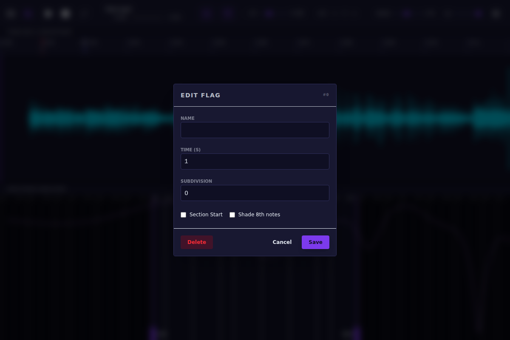

# OSCOPE - Audio Analysis & Transcription Tool

OSCOPE is a powerful, real-time audio visualization and transcription aid designed for musicians, transcribers, and audio engineers. It provides high-fidelity waveforms, spectral analysis, and a robust marker system to help you deconstruct complex audio.

---

## 🚀 Getting Started

### Project Management
OSCOPE uses a "sidecar" file system. When you open an audio file, OSCOPE creates or loads a `.oscope` file in the same directory to store your markers, loops, and settings.
- **Open:** Click the folder icon in the playback bar to load any common audio format (MP3, WAV, FLAC, etc.).
- **Save:** Click the floppy disk icon. The icon will glow with your theme's accent color when there are unsaved changes.

---

## 🎵 Navigation & Playback

- **Zooming:** Use your **Mouse Wheel** over the waveform or spectrum to zoom in/out.
- **Panning:** **Click and Drag** the waveform or spectrum to move through the timeline.
- **Playback Cursor:** **Left Click** anywhere on the timeline to move the playhead.
- **Speed Control:** Use the slider in the bottom bar to adjust speed from 0.1x to 2.0x. OSCOPE uses high-quality time-stretching that preserves pitch.

### High-Quality Enhancement (NovaSR)
When slowing down audio significantly, high-frequency detail is often lost. Enable **High Quality Enhancement** in the settings to use the integrated **NovaSR** neural network, which recovers clarity and "air" in real-time during slow playback.

---

## 🔍 Spectral Analysis & Filtering

The bottom half of the screen displays a constant-Q transform (CQT) spectrogram, mapped to a piano roll.

### Advanced Filtering
You can isolate specific instruments or notes using the real-time band-pass filter:
- **Toggle Filter:** **Right Click** on a filter handle (the vertical lines on the spectrum) to enable or disable that boundary.
- **Quick Placement:** **Right Click** anywhere on the spectrogram to move the nearest filter handle to that frequency.
- **Visual Feedback:** The area outside the filter range is dimmed, helping you focus on the isolated frequencies.

---

## 🚩 Markers & Transcription

OSCOPE uses a dual-flag system to help you map out the structure and harmony of a track.

### Rhythm Flags (Rhythm/Bar Markers)
- **Placement:** Press `B` (default) to drop a rhythm flag at the cursor.
- **Subdivisions:** Open the flag dialog (**Left Click** the flag icon) to set subdivisions (e.g., 4 for quarter notes). These appear as faint vertical lines on the timeline.
- **Metronome:** Rhythm flags automatically trigger a metronome click during playback if subdivision clicks are enabled.
- **Sections:** Mark a flag as a "Section Start" to give it a label (like "Verse" or "Chorus").

### Harmony Flags (Chord Markers)
- **Placement:** Press `H` (default) to drop a harmony flag.
- **Chord Editor:** Click the flag to open the Chord Dialog. You can type chord names (e.g., "Am7", "C/G") or use the selectors.
- **Automatic Analysis:** Use the **Suggest** button to let OSCOPE analyze the audio at that position and recommend the most likely chord.
- **Auditioning:** Click the "Play" button in the dialog to hear the chord played via the internal synthesizer.

### Managing Flags
- **Dragging:** You can **Click and Drag** any flag handle on the timeline to fine-tune its position.
- **Overlaps:** When a Rhythm and Harmony flag occupy the same space, they are displayed at half-height (Harmony on top, Rhythm on bottom) so you can still interact with both.
- **Looping:** Use the Loop button in the playback bar to cycle between markers or the entire track.

---

## ⚙️ Settings & Customization

Access the settings via the gear icon in the playback bar:
- **Visible Piano Keys:** Adjust how many keys are shown in the spectrum's piano roll.
- **Click Volume:** Control the loudness of the metronome subdivisions.
- **High Quality Enhancement:** Toggle the NovaSR super-resolution engine.

### Themes
OSCOPE is fully themeable. Choose a look that suits your environment:
- **Cosmic:** Deep purples and nebular accents.
- **Dark:** Classic, easy-on-the-eyes dark mode.
- **Doll:** High-energy pinks and playful tones.
- **Hacker:** Retro terminal green on black.
- **Light:** Clean, high-brightness professional look.
- **Neon:** Electric blues and high-contrast vibrance.
- **OLED:** Pure black background for maximum contrast.
- **Retrowave:** 80s synthwave aesthetic.
- **Toy:** Bold primary colors.
- **Warm:** Earthy, comfortable tones for long sessions.

---

## ⌨️ Default Keybinds

| Action | Key |
| :--- | :--- |
| Play / Pause | `Space` |
| Add Rhythm Flag | `B` |
| Add Harmony Flag | `H` |
| Delete Selected Flag | `Delete` / `Backsapce` |
| Seek Forward/Back | `Left` / `Right` |
| Zoom In/Out | `+` / `-` |
| Toggle Loop | `L` |
